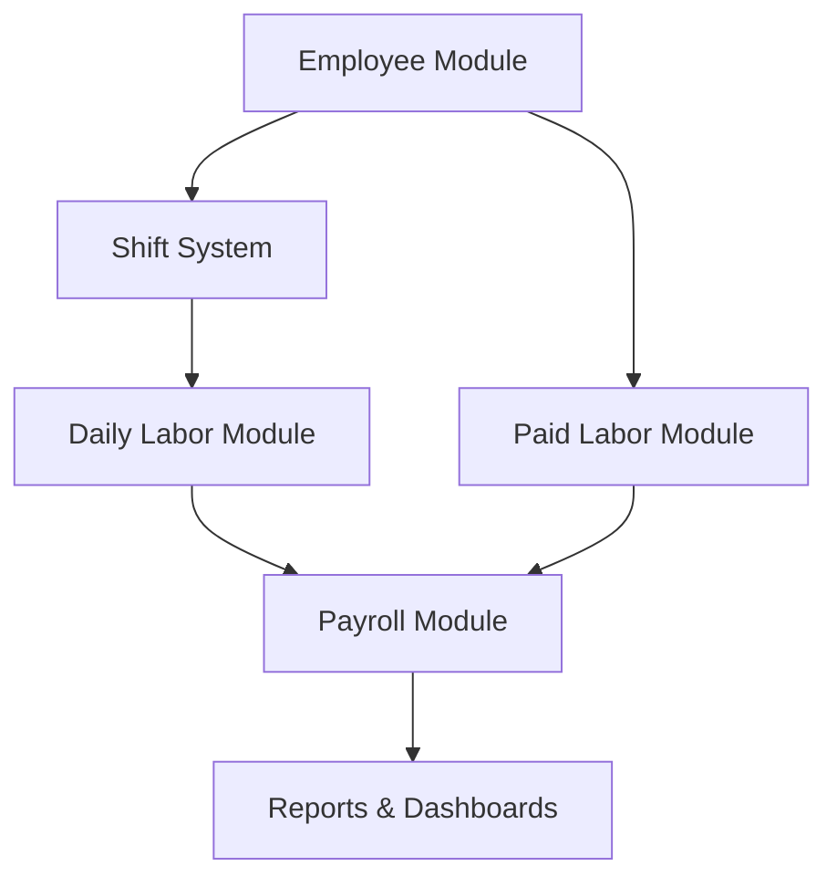
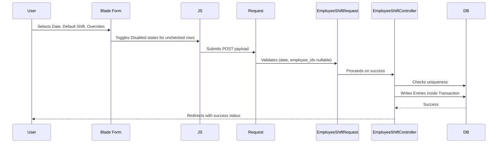
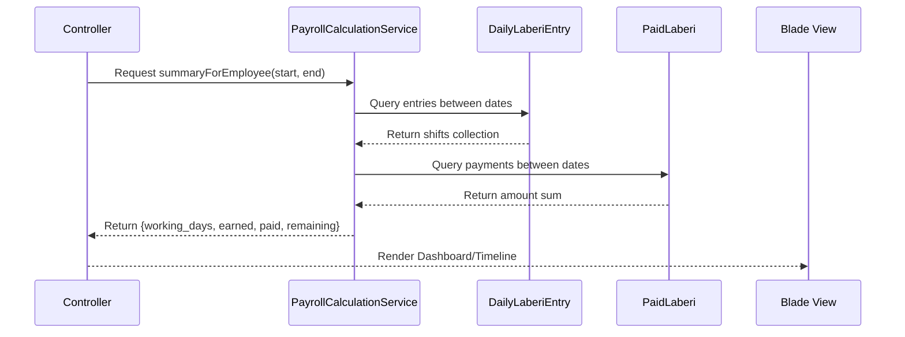
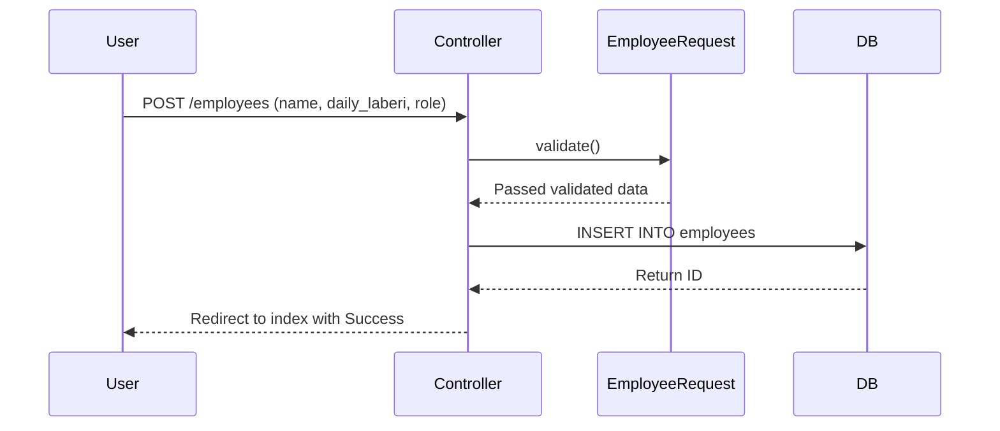
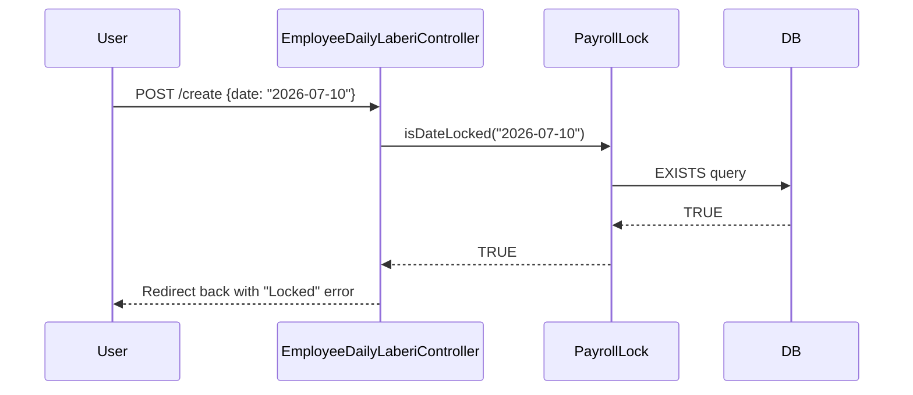

# Employee System - Technical Documentation

## Section 1: High Level Overview
The Employee System is a core Human Resource and Payroll management module in the Shams Print CRM. It solves the problem of tracking daily labor (attendance and shift lengths), disbursing payments (salary, advances, etc.), and calculating dynamic payroll balances over time.

### Architecture Module Map

The architecture uses a unified `PayrollCalculationService` to aggregate variables across independent entries and calculate totals on-the-fly, rather than caching balances on the Employee object.

---

## Section 2: Employee Module
The Employee module defines the worker profiles in the CRM.

- **Required Fields**: `name`, `daily_laberi` (fixed daily pay rate), `role`, `phone_number`, `joining_date`
- **Optional Fields**: `status` (defaults to active), `notes`
- **Employee Roles**: 
  - `helper`
  - `scraper_helper`
  - `kariger`
  - `master`
- **Employee Statuses**:
  - `active`
  - `inactive`

### Database: `employees` Table
| Column | Type | Description |
|---|---|---|
| `id` | bigint | Primary Key |
| `name` | string | Full name |
| `daily_laberi` | decimal(10,2) | Base daily pay rate |
| `role` | string | ENUM (`helper`, `scraper_helper`, `kariger`, `master`) |
| `phone_number` | string | Contact number |
| `status` | string | ENUM (`active`, `inactive`) |
| `joining_date` | date | Date of joining |
| `notes` | text | Nullable remarks |
| `deleted_at` | timestamp | For soft deletes |

---

## Section 3: Shift System
Shifts dictate how much of an employee's base daily pay (`daily_laberi`) is earned on a given date.

### Available Shifts & Multipliers
Managed by `App\Enums\DailyShift`:
- **`leave`**: 0.0 multiplier. Employee was absent. (Not a working day).
- **`off`**: 0.0 multiplier. Scheduled day off. (Not a working day).
- **`half`**: 0.5 multiplier. Half-day worked.
- **`full`**: 1.0 multiplier. Standard full day worked.
- **`darid`**: 1.5 multiplier. Overtime/extended shift worked.

When an employee is assigned a shift, the system stores the string value of the Enum (e.g. `"full"`) into the `daily_shift` column of their daily labor entry.

---

## Section 4: Daily Labor System
Daily labor records the specific shift worked by a specific employee on a specific date. 

- **Storage**: `employee_daily_laberi_entries`
- **Affect on Payroll**: The total accrued earnings for an employee over a time period is the simple sum of the percentages of their assigned shifts, multiplied by their base `daily_laberi` rate.

### Business Rules
- Only **one** shift entry is permitted per employee, per date.
- Can be added individually per employee (`EmployeeDailyLaberiController`), or in bulk across all active employees simultaneously (`EmployeeShiftController`).

---

## Section 5: Paid Labor System
Paid labor tracks all financial disbursements outward to the employee. 

- **Payment Types** (`App\Enums\PaymentType`):
  - `salary`: Standard wage payouts
  - `advance`: Pre-payments/loans
  - `bonus`: Extra performance payouts
  - `deduction`: Fines or clawbacks (Note: Subtracted from pending balance because payments reduce the balance).

- **Storage**: `employee_paid_laberis`

### Business Rules
- Payments can be created individually or in bulk.
- Multiple payments CAN exist on the same date for the same employee.
- Payments decrease the `remaining` balance (amount owed to employee).

---

## Section 6: Payroll System
Payroll calculation is strictly dynamic and handled by `App\Services\PayrollCalculationService`. Nothing is hard-cached.

### Core Calculations

1. **Total Shift Percentage**:
   Sum of the multipliers for all shifts inside the date range.
   *Example*: 3 `full` days + 1 `half` day = `3.5` Total Percentage.

2. **Total Earned**:
   `Total Shift Percentage * Employee's daily_laberi rate`
   *Example*: 3.5 multipliers * 1000 daily rate = `3500.00` Earned.

3. **Total Paid**:
   Sum of `amount` column across all `employee_paid_laberis` in the date range.

4. **Remaining Balance**:
   `Total Earned - Total Paid`
   *(Positive means the company owes the employee; Negative means the employee has taken excess advance).*

### Payroll Locking
Payroll weeks can be locked via the `payroll_locks` table.
- A lock is defined by a `week_start_date` and `week_end_date`.
- When a lock exists for a date, the system **prevents** creating, editing, or deleting any Shifts (`daily_laberi`) or Payments (`paid_laberi`) that fall within that window.
- Checked dynamically using `PayrollLock::isDateLocked($date)`.

---

## Section 7: Data Flow

### Shift Bulk Creation Flow


### Payroll Calculation Flow


---

## Section 8: Relationships
Eloquent Model relationships are defined as follows:

```text
Employee
|
|---- hasMany() -> EmployeeDailyLaberiEntry  (dailyLaberiEntries)
|
|---- hasMany() -> EmployeePaidLaberi        (paidLaberi)

EmployeeDailyLaberiEntry
|
|---- belongsTo() -> Employee

EmployeePaidLaberi
|
|---- belongsTo() -> Employee

PayrollLock
|
|---- belongsTo() -> User                    (lockedBy)
```

---

## Section 9: Database Documentation

### Table: `employee_daily_laberi_entries`
| Column | Type | Rules & Constraints | Purpose |
|---|---|---|---|
| `id` | bigint | Primary, Auto Increment | |
| `employee_id` | bigint | FK (`employees.id`), Cascade Delete | Links shift to employee |
| `laberi_date` | date | Indexed | The date the shift occurred |
| `daily_shift` | string | ENUM string equivalent | Stores the shift enum value |
| `deleted_at` | timestamp | Soft Delete | |
| **Index** | Unique | `UNIQUE(employee_id, laberi_date)` | Prevents duplicate shifts per day |

### Table: `employee_paid_laberis`
| Column | Type | Rules & Constraints | Purpose |
|---|---|---|---|
| `id` | bigint | Primary, Auto Increment | |
| `employee_id` | bigint | FK (`employees.id`), Cascade Delete | Links payment to employee |
| `amount` | decimal(10,2) | `min:0.01` | Monetary value distributed |
| `paid_date` | date | Indexed | The date of the transaction |
| `payment_type` | string | ENUM (`salary`, `advance`, `bonus`, `deduction`) | The categorization of payment |
| `reference_no` | string | Nullable | Receipt or transaction ID |
| `description` | text | Nullable | Free text notes |

### Table: `payroll_locks`
| Column | Type | Rules & Constraints | Purpose |
|---|---|---|---|
| `id` | bigint | Primary, Auto Increment | |
| `week_start_date` | date | | Defines lock window start |
| `week_end_date` | date | | Defines lock window end |
| `locked_by` | bigint | FK (`users.id`) | Audit trail for who locked it |
| `locked_at` | timestamp | | When the lock was placed |
| **Index** | Unique | `UNIQUE(week_start_date, week_end_date)` | Prevents duplicate locks per week |

---

## Section 10: Business Rules

1. **Shift Edits**: No independent edit view exists for daily laberi entries. If an entry is incorrect, the user typically deletes it from the Employee show timeline and re-adds it, provided the payroll date isn't locked.
2. **Employee Deletion**: Employees can be soft-deleted. Due to CASCADE ON DELETE foreign keys, hard-deleting an employee will permanently wipe their shifts and payments.
3. **Inactive Employees**: Inactive employees are hidden from the bulk Shift Assignment list and Payroll index, but their historical profiles remain viewable if accessed directly.
4. **Payroll Overpayment**: The system allows `Total Paid` to exceed `Total Earned` without throwing validation errors. The resultant `Remaining Balance` simply becomes negative (interpreted as an Employer-held advance).
5. **No Employee Selected on Bulk Shift**: If all checkboxes are unchecked on the bulk shift page, the system securely cascades a `Leave` shift to all active employees.

---

## Section 11: Edge Cases

- **Duplicate Shift Insertion**: If a user attempts to bulk-create shifts for a date where *any* employee already has a shift, the validation blocks the entire transaction.
- **Payrolls Lock Edge**: Since locks query `>= week_start` and `<= week_end`, applying a fix covering a weekend overlap (if boundaries aren't perfectly aligned via Carbon default weeks) will strictly reject insertions.
- **Soft Delete Conflicts**: Because `(employee_id, laberi_date)` is unique but does not include `deleted_at`, a soft-deleted shift **will block** the creation of a new shift for the same employee on the same date natively at the database level.
- **Partial Payments**: Supported inherently. An employee can receive 3 payments of 500 across a week instead of 1 payment of 1500; the aggregation service handles this seamlessly.

---

## Section 12: Calculations Reference

- **`totalShiftPercentage`**: 
  *Source: `PayrollCalculationService.php:38`*
  *Formula:* `SUM(shift_multipliers)`
- **`workingDays`**: 
  *Source: `PayrollCalculationService.php:46`*
  *Formula:* `COUNT(entries WHERE shift NOT IN ('off', 'leave'))`
- **`totalEarned`**: 
  *Source: `PayrollCalculationService.php:55`*
  *Formula:* `Employee->daily_laberi * totalShiftPercentage`
- **`totalPaid`**: 
  *Source: `PayrollCalculationService.php:60`*
  *Formula:* `SUM(employee_paid_laberis.amount)`
- **`remainingAmount`**: 
  *Source: `PayrollCalculationService.php:67`*
  *Formula:* `totalEarned - totalPaid`

These calculations are heavily recycled into the `timeline` mapping array shown on `EmployeeController@show`, calculating lifetime and custom date range variants securely using Eloquent Scopes `->betweenDates()`.

---

## Section 13: Sequence Diagrams (Extra)

### Create Employee Flow


### Shift Lock Rejection Flow


---

## Section 14: Potential Improvements

1. **Database Architecture**: Include `deleted_at` in the unique compound index for `employee_daily_laberi_entries`. Without it, a soft-deleted shift permanently blocks any new shifts from being added to that date.
2. **Performance Improvements**: `PayrollCalculationService` heavily utilizes `$collection->sum()` after executing an open `->get()` query. As the database grows natively, fetching thousands of timeline rows just to `sum()` them in PHP memory is very inefficient. This should be rewritten to use SQL `$query->sum('amount')` natively. 
3. **UX Improvements**: Add an inline edit capability (AJAX) for the employee timeline. Currently, correcting a mistakenly added `darid` shift requires deleting it entirely and recreating it via full page reloads.
4. **Validation Handling**: Allow partial bulk shift insertions. Currently, if 1 out of 20 employees has a conflicting shift date, the controller throws a blanket validation error `duplicates block` for everyone. Modifying the loop to use `->firstOrCreate()` would gracefully skip duplicates.
5. **Code Quality**: Hardcoding `$lifetimeStart = '1970-01-01'` in `EmployeeController` works, but could be cleaner by omitting the `betweenDates` scope entirely when an overarching lifetime metric is requested.
